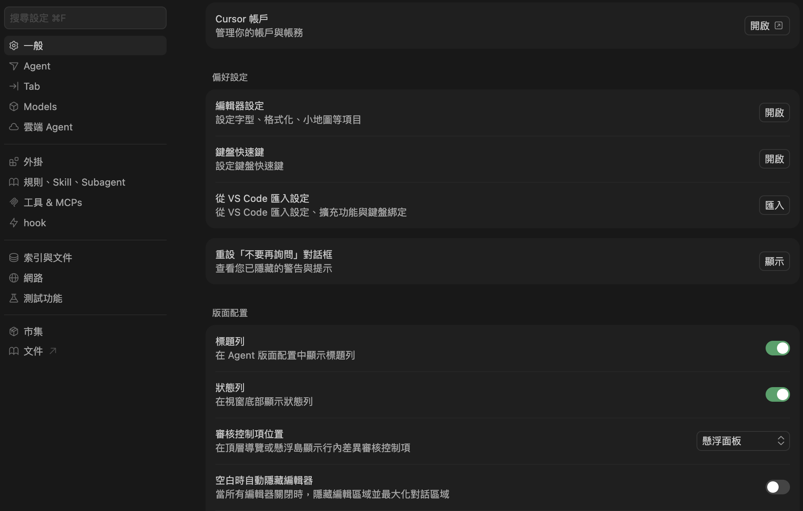

# Cursor 語言切換（Cursor Language Toggle）

Cursor 語言切換是可安裝在 Cursor／VS Code 的延伸模組，提供介面語言快速切換。  
可在英文、繁體中文、簡體中文與日文之間切換，並支援 `.vsix` 離線安裝。



## 功能特色

- 支援語言：`original`、`zh-TW`、`zh-CN`、`ja-JP`
- 支援設定頁、命令選擇區與側邊欄面板操作
- 提供本機備份與還原流程，避免語言切換造成檔案無法還原的變更
- 系統語言模式可自動處理語言套件安裝與切換

## 安裝方式

```bash
cd Cursor-toggle
vsce package
```

打包完成後，在 Cursor／VS Code 使用「從 VSIX 安裝…」（Install from VSIX...）安裝。

## 使用方式（延伸模組）

安裝後，在設定頁選擇：

- `cursorZhPatch.settingsLocale`（Cursor 設定選單）
    - `original`：還原英文
    - `zh-TW`：套用繁體中文補丁
    - `zh-CN`：套用簡體中文補丁
    - `ja-JP`：套用日文補丁
- `cursorZhPatch.systemLocale`（系統語言選單）
    - `original`：系統語言切換為英文（English）
    - `zh-TW`：安裝繁中語言套件並切換系統語言
    - `zh-CN`：安裝簡中語言套件並切換系統語言
    - `ja-JP`：切換系統語言為日文

若曾使用舊版布林設定 `cursorZhPatch.enableTraditionalChinese`，延伸模組啟動時會移除舊鍵，語言預設維持 `original`。

每次切換完成後會顯示通知，提供「立即重啟視窗」按鈕，可快速重啟讓變更生效。

`Cursor 設定選單` 僅處理補丁套用與還原，不會觸發語言套件安裝。  
`系統語言選單` 才會處理市集語言套件安裝（`ms-ceintl.vscode-language-pack-zh-hant` / `ms-ceintl.vscode-language-pack-zh-hans` / `ms-ceintl.vscode-language-pack-ja`）與系統語言切換。  
系統語言切換時會先移除舊語言套件，再安裝新語言套件。  
若市集安裝失敗，會顯示提示，但不會中斷流程。

若從未套用過繁中／簡中就直接選「還原英文」，會提示尚未建立本機備份；請先套用一次中文以建立備份。  
Cursor 主程式更新後，若擔心備份與目前版本不一致，建議先還原英文或重新安裝 Cursor 後再使用本延伸模組。

## 專案結構

- `package.json`：延伸模組詮釋資料、設定與命令註冊。
- `main.js`：設定監聽與切換流程進入點。
- `translations/settings.zh-TW.json`：英文到繁體中文對照表。
- `translations/settings.zh-CN.json`：英文到簡體中文對照表。
- `translations/settings.ja-JP.json`：英文到日文對照表。
- `scripts/cursor-patcher.js`：依語言套用翻譯（可 CLI 或延伸模組呼叫）。
- `scripts/restore-cursor.js`：還原英文邏輯（快照版，可 CLI 或延伸模組呼叫）。
- 延伸模組首次自「英文」切換到繁中／簡中前，會將本機 Cursor 的 `workbench.desktop.main.js` 與 `nls.messages.json` 備份至延伸模組的 globalStorage（每台電腦／每位使用者各有一份）；「還原英文」僅還原至該備份，**不**使用套件內任何預先打包的快照。

## 命令選擇區

- `Cursor 語言切換：還原英文`
- `Cursor 語言切換：套用繁體中文`
- `Cursor 語言切換：套用簡體中文`
- `Cursor 語言切換：日本語を適用`
- `Cursor 語言切換：立即重啟視窗`

## CLI（選用）

在 `Cursor-toggle` 目錄下：

```bash
node scripts/cursor-patcher.js
node scripts/cursor-patcher.js --zh-cn
node scripts/cursor-patcher.js --zh-tw
node scripts/cursor-patcher.js --ja-jp
```

CLI 還原預設讀寫本機的 `scripts/restore-baseline.json`（僅由 `--capture-baseline` 產生，不納入儲存庫、不打包進 `.vsix`）。若尚未建立該檔，請先執行：

```bash
node scripts/restore-cursor.js --capture-baseline
node scripts/restore-cursor.js
```

## 打包為 .vsix

```bash
cd Cursor-toggle
vsce package
```

完成後產生 `.vsix`，可在 Cursor／VS Code 安裝。

## 安全機制

- 智慧型字詞邊界辨識，降低誤替換風險。
- 更新 `product.json` checksums，維持檔案一致性。
- 延伸模組還原流程以本機 globalStorage 快照為基準；CLI 還原以 `scripts/restore-baseline.json` 為基準（開發者自行 `--capture-baseline` 建立）。

## 相容性提醒

- Cursor 更新版本後，可能需要更新翻譯字典或替換規則。
- 若出現寫入權限問題，請確認 Cursor 安裝目錄可被目前使用者寫入。

## 新增語言需同步修改清單

新增語言時，請務必一次同步修改下列檔案，避免只改單點造成功能或文案不一致。

1. 延伸模組宣告層（設定、命令、側欄名稱）

- `package.json`
    - `contributes.configuration.properties.cursorZhPatch.settingsLocale.enum`
    - `contributes.configuration.properties.cursorZhPatch.settingsLocale.enumDescriptions`
    - `contributes.configuration.properties.cursorZhPatch.systemLocale.enum`
    - `contributes.configuration.properties.cursorZhPatch.systemLocale.enumDescriptions`
    - 若要支援命令選擇區直接切換，也要新增 `contributes.commands` 對應命令
- `package.nls.json` 與各語言 `package.nls.*.json`
    - 新增／同步對應 key（含 enumDescriptions、command title、container／view title）

2. 核心語言流程（延伸模組執行邏輯）

- `main.js`
    - `LOCALES`
    - `resolveLocalizedExtensionName()`
    - `normalizeUiLocale()`（UI 語言歸一化）
    - `SYSTEM_DISPLAY_LOCALE_MAP`
    - `DISPLAY_TO_SYSTEM_LOCALE_MAP`
    - `getLanguagePackIdForLocale()`
    - 系統語言切換流程中的語言套件顯示名分支
    - Webview HTML 內兩個 select 的 option（`cursorSettingsSelect`／`systemLocaleSelect`）

3. Webview 文案與前端語言支援

- `media/i18n-package.js`
    - `dictionaries` 新增語言字典（所有既有 key 都要補齊）
- `media/panel.js`
    - `FALLBACK_LOCALES`
    - 若新增語言選項 key，需同步 `LANGUAGE_OPTION_I18N_KEYS`
- `media/panel.css`
    - 若新語言需要指定字型，補上對應 `data-selected-locale`／`data-locale-option` 樣式

4. 補丁翻譯來源與 CLI

- `scripts/cursor-patcher.js`
    - `TRANSLATION_PATH_BY_LOCALE`
    - `applyPatch()` 的語言允許清單
    - CLI 參數分支（若要支援新語言旗標）
- `translations/settings.<locale>.json`
    - 新增對應翻譯檔，並確保檔名與 `TRANSLATION_PATH_BY_LOCALE` 一致

5. 文件同步

- `README.md`
    - 支援語言列表
    - CLI 範例
    - 任何與語言數量或語言代碼相關描述

補充：

- 日文目前同時存在 `package.nls.ja.json` 與 `package.nls.ja-jp.json`（相容用途）。新增其他語言時，請先決定是否也採雙檔相容策略，避免後續維護重複。
